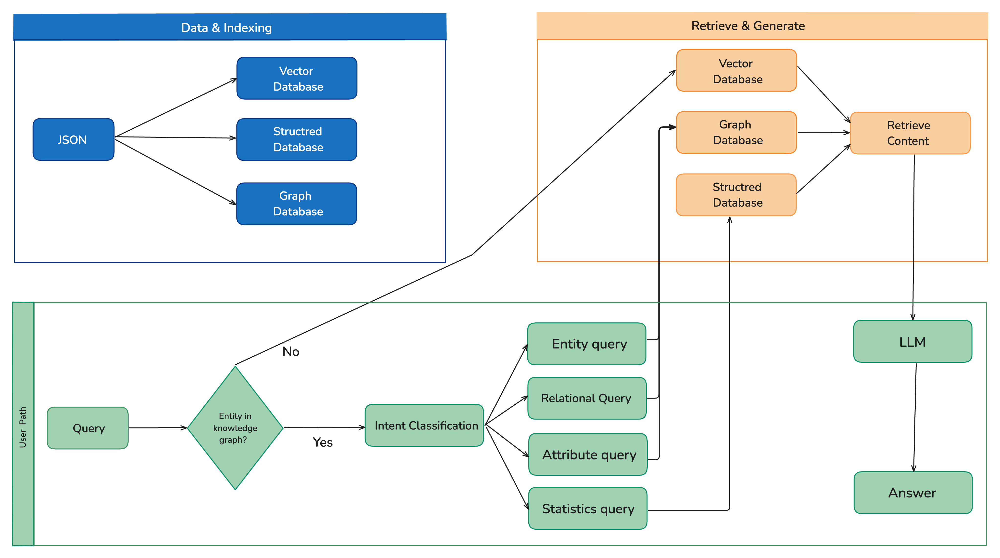
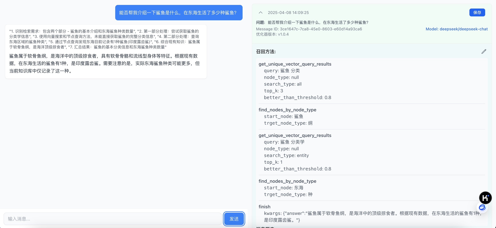
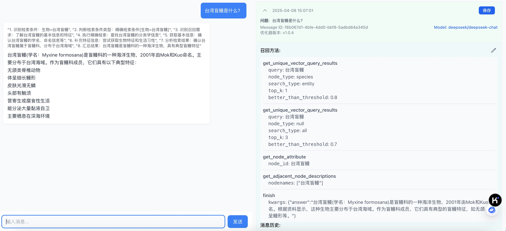
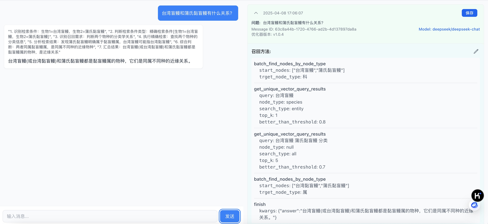
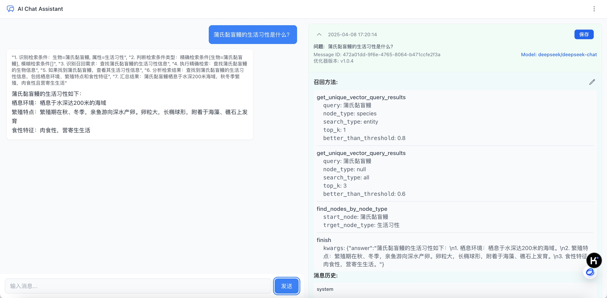
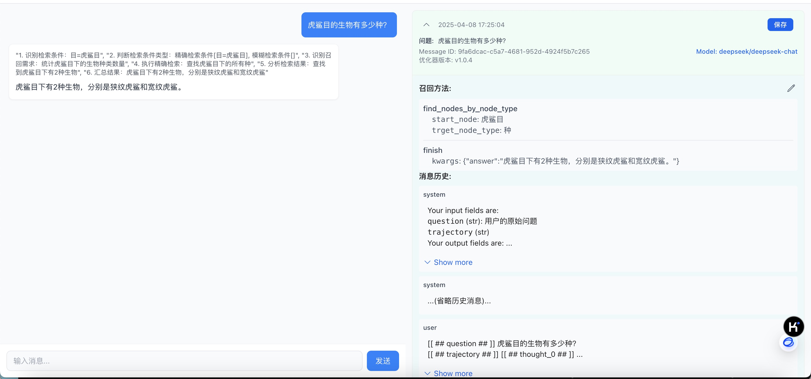
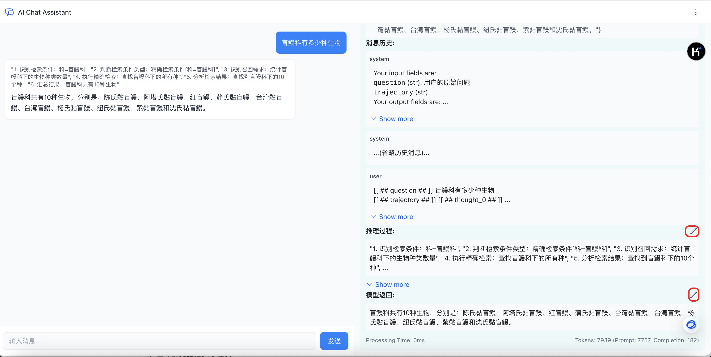
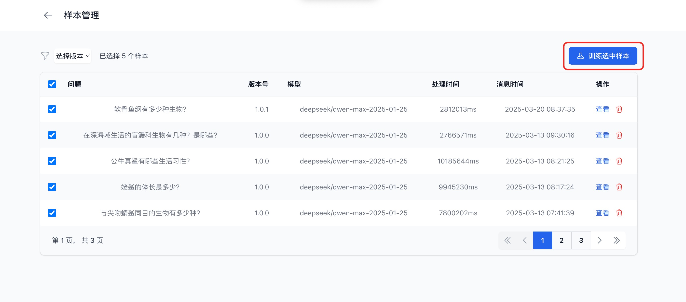

<h1 align="center">🌟 Datacapsule 🌟</h1>

Datacapsule is a knowledge graph-based multi-path retrieval solution designed to achieve precise knowledge retrieval through multi-path retrieval technology. This solution encompasses multiple functional modules, including retrieval systems, entity relationship extraction, entity attribute extraction, entity linking, structured database construction, and question answering systems, providing powerful support for information retrieval and applications.

<br>

<div align="center">
  
  
  
  
  
  <br />
  
  
</div>


# Background
Knowledge graph multi-path retrieval technology is widely used in the field of information retrieval. By constructing a graph database containing rich entities and relationships, it allows users to query relevant information through various methods (such as keywords, entity linking, etc.). This approach not only improves the efficiency of information retrieval but also helps users better understand and utilize complex relationships in the data.

However, traditional knowledge graph construction has limited speed and efficiency, necessitating a more efficient method for graph construction. At the same time, there are also issues with the efficiency of graph-based retrieval. Therefore, we propose a knowledge graph-based multi-path retrieval technology solution aimed at improving construction efficiency and optimizing retrieval results.
The system conducts deep understanding of user questions, first determining whether the entities in the user's question exist in the graph. If not, answers are directly obtained through vector retrieval.

If the entity exists in the graph, the system then determines the type of user question, such as: entity query (e.g., "What is the Taiwan hagfish?"); relationship query (e.g., "What is the relationship between the Taiwan hagfish and the Eptatretus stoutii?"); attribute query (e.g., "What are the living habits of the Eptatretus stoutii?"); statistical query (e.g., "How many species are in the hagfish family?"). Entity queries, relationship queries, and attribute queries are retrieved through graph structure retrieval; statistical queries are retrieved through structured retrieval. 

# Main Features

1. **Function Design Diagram**:
     

2. **Project Structure Overview**:

- backend/ (Backend service directory)
  - dspy_program/ (DSPy models and programs directory)
    - retrieval_demo_18.json (Small sample dataset)
    - retrieval_demo_130.json (Full-scale dataset)
    - optimized_program.pkl (Optimized DSPy program)
    - signature.py (DSPy signature definition file)
    - examples/ (Training example data)
  - graph_data_new/ (Knowledge graph data directory)
    - knowledge_graph-1.html (Knowledge graph visualization file)
    - knowledge_graph-1.graphml (Knowledge graph data file)
    - vectors/ (Vector data storage directory)
      - bio_vectors.json (Biological entity vector data)
      - relation_vectors.json (Relationship vector data)
  - tools/ (Tool module directory)
    - entity_extraction.py (Entity extraction tool)
    - entity_extraction_db.py (Structured database construction tool)
  - .dspy_cache/ (DSPy cache directory)
  - app.py (Main application entry)
  - dspy_evaluation.py (Evaluation module)
  - dspy_inference.py (Inference module)
  - dspy_query_db.py (Database query module)
  - nanovector_db.py (Vector database implementation)
  - react_tools.py (Graph query and vector retrieval tools)
  - requirements.txt (Dependency list)
  - .env (Environment configuration file)

- frontend/ (Frontend service directory)
  - src/ (Source code directory)
    - components/ (Components directory)
      - Chat/ (Chat related components)
      - Graph/ (Knowledge graph display components)
      - UI/ (UI elements components)
    - hooks/ (React hook functions)
    - services/ (Service call modules)
    - App.tsx (Main application component)
    - main.tsx (Entry file)
  - public/ (Static resource directory)
    - images/ (Image resources)
  - package.json (Project configuration and dependencies)
  - vite.config.ts (Vite configuration file)
  - tailwind.config.js (TailwindCSS configuration)
  - .env.example (Environment variable example)

3. **Knowledge Graph and Structured Database Construction**: Using DSPy as an intent recognition method to process entity extraction and build graph information, corresponding to the `entity_extraction.py` module, extracting the built graph information into structured information and storing it in a database, corresponding to the `entity_extraction_db.py` module.

4. **Knowledge Graph Storage and Management**: Knowledge graph storage and management functionality based on NetworkX, supporting dynamic construction and querying of entity relationships, corresponding to the `ReActTools` module in `react_tools.py`.

5. **Vector Database Retrieval**: Lightweight vector database based on NanoVector, supporting efficient semantic similarity retrieval, corresponding to the `NanoVectorDB` module in `nanovector_db.py`.

6. **Graph-based Multi-path Retrieval Method**:

   - Chain of Thought-based reasoning system
   - Multi-turn dialogue context understanding
   - Forms a complete reasoning and querying system
      `dspy_inference.py` integrates various retrieval methods; provides a unified query interface
      `dspy_query_db.py` handles structured data queries
      `react_tools.py` integrates vector retrieval and graph retrieval, where the `ReActTools` class is responsible for graph structure retrieval, and the `GraphVectorizer` class is responsible for vector retrieval, calling the functionality of `NanoVectordb.py`
      `nanovector_db.py` encapsulates the NanoVector library, providing vector database querying, storage, and vector similarity calculation functions
      `dspy_evaluation.py` ensures reasoning quality and model optimization

   System Collaborative Workflow:
   1. User initiates a query → `dspy_inference.py`
   - Receives the user's question
   - Responsible for overall inference process control
   - Determines whether entities in the question exist in the knowledge graph:
     * If not in the graph: directly uses vector retrieval to get answers
     * If in the graph: further determines the question type
   - Question type determination and corresponding retrieval strategies:
     * Entity query (using graph structure retrieval) 
       Example: "What is the Taiwan hagfish?"
     * Relationship query (using graph structure retrieval)
       Example: "What is the relationship between the Taiwan hagfish and the Eptatretus stoutii?"
     * Attribute query (using graph structure retrieval)
       Example: "What are the living habits of the Eptatretus stoutii?"
     * Statistical query (using structured retrieval)
       Example: "How many species are there in the order Hexanchiformes?"

   2. Multi-path Retrieval Phase:
      a) Vector Retrieval Path:
         `dspy_inference.py → react_tools.py (GraphVectorizer class) → nanovector_db.py`
         - Converts questions to vectors
         - Calculates vector similarity
         - Returns relevant entities
      b) Graph Structure Retrieval Path:
         `dspy_inference.py → react_tools.py (ReActTools class)`
         - Performs graph traversal based on entities
         - Finds related nodes and relationships
         - Returns structured knowledge
      c) Structured Retrieval Path:
         `dspy_inference.py → dspy_query_db.py`
         - Converts natural language to SQL
         - Queries structured database
         - Returns exact matching results
   3. Result Integration and Reasoning:
      - `dspy_inference.py` integrates multi-path retrieval results
      - Uses DSPy for reasoning and answer generation
      - Generates structured responses
   4. Evaluation and Optimization:
      `dspy_evaluation.py`
      - Evaluates answer quality
      - Collects user feedback
      - Used for model optimization
      - Updates optimizer data
   5. Returns Results to User:
      - Streams answers back
      - Saves interaction records
      - Updates system status

   Corresponding to the `dspy_inference.py`, `dspy_evaluation.py`, and `dspy_query_db.py` modules.

7. **Real-time Communication and State Synchronization**:
   - Real-time message pushing implemented with WebSocket
   - Supports streaming conversation responses
   - Real-time feedback of optimizer status
   Corresponding to the WebSocket implementation in `broadcast.py` and `app.py`.

8. **Model Optimizer**:
   - Supports model optimization based on user feedback
   - Version management and rollback functionality
   - Visualization of optimizer processes
   Corresponding to the evaluation optimization module in `dspy_evaluation.py`.

9. **Database Management System**:
   - SQLite storage for user interaction records
   - Supports batch processing of vector data
   - Data version control
   Corresponding to the database management functionality in `dspy_query_db.py`.

10. **Frontend Interactive Interface**:
   - Modern interface based on React 18 + Vite
   - Real-time dialogue window
   - Collection of user Q&A pairs
   - Reasoning process display
   - Optimization progress display
   Corresponding to the implementation in the `frontend` directory.

11. **System Monitoring and Logging**:
   - Hierarchical logging system based on loguru
   - Performance monitoring and error tracking
   - API call statistics
   Corresponding to the logging implementations in various modules.

12. **Environment Configuration Management**:
    - Support for multiple LLM model configurations
    - Flexible environment variable management
    - Multi-environment deployment support
    Corresponding to the configuration management in `.env` and `.env.example`.

# Technical Framework
## **Frontend Technology Stack**
- Development Language: JavaScript+TypeScript
- Frontend Framework: React 18 + Vite
- UI Framework: TailwindCSS
- Development Tools:
  * Build Tool: Vite
- Real-time Communication: WebSocket client

## **Backend Technology Stack**
- Development Language: Python (Recommended version: 3.8+)
- Web Framework: FastAPI
- Databases:
  * Structured Data: SQLite
  * Vector Database: NanoVector (Lightweight vector database)
  * Graph Structure Information Storage: NetworkX (For knowledge graph storage)
- Knowledge Extraction:
  * Entity & Relationship Extraction: DSPy + CoT (Chain of Thought)
- AI Models:
  * Embedding Model: See configuration in backend/.env.example
  * Large Language Model: Supports OpenAI/DeepSeek, etc., see configuration in backend/.env.example
- Development Tools:
  * Dependency Management: pip
  * Environment Management: python-dotenv
  * Logging System: loguru

## **System Architecture**
- Frontend-backend separation architecture
- WebSocket real-time communication
- Vector retrieval + Graph retrieval + text2sql hybrid recall
- DSPy intent understanding and reasoning

**This project focuses primarily on the implementation of the solution, with some code generated by cursor for efficiency**


# Project Dependencies
See requirements.txt for details 

# Quick Start

## 1. Install Dependencies
```bash
pip install -r backend/requirements.txt
```
Note: If you encounter errors during installation, it might be due to formatting issues in the requirements.txt file. Suggestions:
- Copy the contents of requirements.txt to a new file
- Check for and remove any special characters
- Use the newly created dependency file for installation

## 2. Configure Environment Variables
Create a .env file in the backend directory based on the .env.example template. The main configuration items are as follows:

a) Large Language Model Configuration:
    This project uses DSPy for intent recognition and requires configuration of two separate models:
    DSPy official documentation: https://www.aidoczh.com/dspy/
    1. Q&A/Inference Model: Used for processing user queries and reasoning
    2. Optimization Model: Used for model optimization
    Both models can use the same or different configurations, supporting OpenAI-SDK format models:
    - OpenAI API series: GPT-3.5/4/4o
    - DeepSeek series: deepseek-chat/coder
    - Alibaba Cloud series: Qwen
    - Baidu ERNIE series: ERNIE-Bot
    - Ollama local deployment
    - HuggingFace deployment
    - VLLM high-performance deployment


    # Q&A/Inference Model Configuration (for processing user queries and reasoning)
    LLM_TYPE="deepseek"                # Model type (can be replaced with other models)
    API_KEY="sk-xxxxxxxxxxxxxxxx"             # API key
    BASE_URL="xxxxxxxxxxxxxxxxxxxxx"  # API base URL
    LLM_MODEL="deepseek-chat"          # Specific model name
    
    # Ollama Configuration (Local deployment solution, suitable for offline environments)
    # LLM_TYPE="ollama_chat"           # Set to use Ollama local model
    # API_KEY=""                       # Ollama local deployment does not require an API key
    # BASE_URL="http://localhost:11434" # Local address of Ollama service
    # LLM_MODEL="xxxxxxxxxxxxx"           # Specific model to use
    
    # Optimization Model Configuration (for model optimization, can be ignored if not optimizing)
    Train_LLM_TYPE="deepseek"            # Optimization model type (can be replaced with other models)
    Train_LLM_MODEL="deepseek-chat" # Specific model used for optimization
    Train_OPENAI_API_KEY="xxxxxxxxxxxxxxxxxxxxx"  # API key for the optimization model
    Train_OPENAI_BASE_URL="xxxxxxxxxxxxxxxxxxxxx"  # API address for the optimization model

b) System Environment Configuration (Core paths and parameter settings):
   ```
   RAG_DIR="graph_data_new"              # Knowledge graph data storage directory
   LOG_LEVEL="DEBUG"                     # Log level (Options: DEBUG, INFO, WARNING, ERROR)
   DATABASE_URL="sqlite:///.dbs/interactions.db"  # Interaction database path
   SPECIES_DB_URL="./.dbs/marine_species.db"     # Species database path
   ```

c) Vector Retrieval Configuration (Key parameters affecting retrieval performance):
   ```
   VECTOR_SEARCH_TOP_K=3                 # Maximum number of results returned by vector retrieval
   BETTER_THAN_THRESHOLD=0.7             # Similarity filtering threshold (between 0-1)
   GRAPHML_DIR="graph_entity_relation_detailed.graphml"  # Knowledge graph storage file
   ```

d) Embedding Model Configuration (Text vectorization parameters):
   ```
   MAX_BATCH_SIZE=100                    # Batch size, affects processing speed
   EMBEDDING_MAX_TOKEN_SIZE=8192         # Maximum number of tokens per process
   EMBEDDING_DIM=1024                    # Vector dimension
   EMBEDDING_MODEL="xxxxxxxxxxxxxxx"   # Embedding model used
   EMBEDDING_MODEL_BASE_URL="xxxxxxxxxxxxxxxxxxxxx"
   EMBEDDING_MODEL_API_KEY="your-embedding-api-key"  # API key for the embedding service
   ```

Important Notes:
- All items marked as "your-xxx-api-key" must be replaced with your actual API keys
- API keys can be obtained from the respective service provider platforms
- Please ensure all necessary configurations are completed before running the program
- Paths in the configuration file can be adjusted according to your actual deployment environment
- It is recommended to verify the correctness of the configuration in a test environment before formal deployment

## 3. Run Services
## Environment Configuration
This project uses environment variables to configure API and WebSocket addresses.

### Configuration Steps
1. Copy the `.env.example` file and rename it to `.env` (or `.env.development`, `.env.production`, etc.)
2. Modify the variable values in the file according to your environment

### Available Environment Variables
- `VITE_API_URL`: Backend API address
- `VITE_WS_URL`: WebSocket service address

### Start Backend Service
```bash
cd backend
python app.py
```
### Start Frontend Service
```bash
cd frontend 
npm install
- Development environment: `npm run dev` (Uses configuration from `.env.development` or `.env`)
- Production build: `npm run build` (Uses configuration from `.env.production`)
```
## 4. Data Processing Information
This project provides two data processing methods:
1. Use built-in example data (default method)
2. Use custom data:
   - Use tools/entity_extraction.py for graph data extraction
   - Use entity_extraction_db.py for structured data extraction and storage
   - Processed data will be automatically stored in the locations specified in the configuration file:
     * Graph data: Saved in the directory specified by RAG_DIR
     * Structured data: Saved in the database file specified by SPECIES_DB_URL 

## 5. Operation Steps
**Successful startup interface is as follows**:


**Questions with entities not in the graph:**



**Additional Explanation**: When the entity in a user's query does not exist in the knowledge graph, the system automatically switches to vector retrieval strategy. The current configuration uses a `top_k=1` parameter, returning only the single result with the highest similarity. This design performs well when handling fuzzy queries within a professional domain, but has limitations when facing queries outside the domain:

1. For complex questions requiring multiple information sources, a single result may not be comprehensive
2. For statistical questions (such as "How many types..."), the system can only answer based on limited context
3. For non-professional domain questions, there is insufficient background knowledge for accurate responses

This limitation is a trade-off in the current system design and can be improved through:
- Adjusting the `top_k` parameter in `dspy_inference.py` to get more results
- Implementing intelligent forwarding to general models for non-domain questions
- Expanding the knowledge graph to cover a wider range of entity information

**Questions with entities in the graph:**

- **Entity Query Questions:**

  

- **Relationship Query Questions:**

  

- **Attribute Query Questions:**

  

- **Statistical Query Questions:**

  

  The correctness of the questions can be verified in ~backend/docs/demo130.json

- **Knowledge Graph Display:**

  - Click the link on the homepage to access the knowledge graph information

- **Building Optimization Samples**:

  - Manually modify the content in the "Reasoning Process" and "Model Return" sections on the frontend page
  - Under the current architecture, small sample optimization data (30-50 entries) can achieve some effect
  - 

- **Optimize Samples:**

  -  

### DSPy Intent Understanding Mechanism

1. **Zero-shot Understanding Capability**:

   - The DSPy framework uses the ReAct (Reasoning+Acting) pattern, allowing large models to understand user intent without pre-training
   - The system integrates various tool functions through the `ReActModel` class in `dspy_inference.py`
   - The large model automatically selects the most appropriate tool based on the question semantics, for example:
     * Entity question: "What is the Taiwan hagfish?" → calls `find_nodes_by_node_type`
     * Statistical question: "How many species are in the hagfish family?" → calls appropriate counting and query methods

2. **Zero-shot Understanding Implementation Principle**:

   - In `dspy_inference.py`, the ReAct module automatically parses the signature and documentation string of each tool function:
     ```python
     # Core code in dspy_inference.py
     self.react = dspy.ReAct(
         DspyInferenceProcessor.MarineBiologyKnowledgeQueryAnswer,
         max_iters = MAX_ITERS,
         tools=[
             processor.find_nodes_by_node_type, 
             processor.get_unique_vector_query_results,
             # ...other tools
         ]
     )
     ```

   - The detailed documentation of tool functions provides key context, such as the description in `find_nodes_by_node_type`:
     ```python
     def find_nodes_by_node_type(self, start_node, trget_node_type):
         '''
         This method finds a list of nodes of the specified node type starting from the given node name in the graph data.
         start_node is the name of the tree node to start searching from, only allowing a single node.
         trget_node_type is the target node type, only allowing a single type name.
         The return value is the number and list of nodes with the specified property name starting from that node.
         Known graph data contains a series of marine biology related information:
         1. Biological taxonomy graph data: including "Latin scientific name", "naming year", "author", "Chinese scientific name"
         2. Biological family and genus data: "kingdom", "phylum", "class", "order", "family", "genus", "species"...
         '''
     ```

   - DSPy internally generates implicit prompts that guide the model in how to select tools for different questions:
     * When a question contains "What is the Taiwan hagfish", the model understands this is querying the description of a specific entity
     * When a question contains "How many species are in the hagfish family", the model understands this requires a counting operation

   - The large model's chain of thought capability (reflected in `react_tools.py`) allows the system to:
     * Analyze key entities and relationships in the question
     * Plan multi-step retrieval strategies
     * Adjust subsequent operations based on intermediate results

   This zero-shot understanding capability does not rely on predefined hardcoded rules, but rather on:
   1. Clear function naming and documentation
   2. DSPy's prompt engineering automation
   3. The large model's contextual understanding ability
   4. The ReAct framework's reasoning-action loop mechanism

3. **Tool Selection Mechanism**:
   ```python
   self.react = dspy.ReAct(
       DspyInferenceProcessor.MarineBiologyKnowledgeQueryAnswer,
       max_iters = MAX_ITERS,
       tools=[processor.find_nodes_by_node_type, ...]
   )
   ```
   - The model analyzes question features through Chain-of-Thought
   - Dynamically selects tool combinations based on question type
   - Handles multiple question types without hardcoded rules

###  DSPy Optimization Principles and Effects

1. **Optimization Technology Essence**:
   - DSPy optimization is not traditional parameter fine-tuning, but **prompt engineering automation**
   - The system collects user feedback data through the evaluator in `dspy_evaluation.py`
   - The optimization process is stored in program files (.pkl and .json) in the `dspy_program` directory

2. **Optimization Process**:
   ```python
   # Optimization logic in app.py
   async def run_dspy_optimization(training_data: List[Dict], version: str, ids: List[str]):
       # Collect optimization data
       # Build evaluation metrics
       # Optimize reasoning program
       # Save optimized model
   ```
   - Collect user questions and feedback data as optimization samples
   - Use BiologicalRetrievalEvaluation to evaluate reasoning quality
   - Apply multiple iterations of optimization to generate more precise thinking chain templates

3. **Optimization Effects**:
   - **Intent Understanding Enhancement**: The system can more accurately distinguish between entity queries, relationship queries, attribute queries, and statistical queries
   - **Tool Selection Optimization**: The model learns to combine retrieval tools more efficiently, reducing unnecessary retrieval steps
   - **Reasoning Pattern Improvement**: By analyzing successful cases, the system generates more structured reasoning paths
   - **Domain Adaptability**: The optimized system shows stronger domain-specific understanding capabilities, especially in handling marine biology terminology

4. **Version Comparison**:
   - The optimization effect can be seen by comparing `program_v1.0.1_20250302192606.json` and `program_v1.0.3_20250315154834.pkl` 


## 6. Communication and Issue Discussion
## About Data

### 1. Data Source Replacement

#### Built-in Data Source Replacement

This project contains two built-in example datasets (`demo18.json` and `demo130.json`), which share the same structure but differ in data volume. Replacement steps:

```bash
# Replace small test dataset
cp your_small_dataset.json backend/docs/demo18.json

# Replace complete dataset
cp your_full_dataset.json backend/docs/demo130.json
```

The two datasets share the same structure and fields, differing only in data volume, convenient for quick testing and complete training.

#### Custom Data Introduction

Introducing your own domain data requires the following comprehensive adjustments:

1. **Prepare JSON Format Data**
   - The system primarily supports JSON format, containing entity, relationship, and attribute fields

2. **Entity Extraction and Graph Construction**
   - Use `tools/entity_extraction.py` to extract entities from JSON and build the graph
   - Need to modify extraction logic to adapt to your data structure
   - Customize entity type and relationship type mapping

3. **Establish Structured Database**
   - Use `tools/entity_extraction_db.py` to create a relational database
   - Adjust database table structure design
   - Modify field mapping and indexing strategies

4. **Comprehensive DSPy Component Adjustment**

   a. `dspy_inference.py`:
      - Redefine question types and intent classification
      - Modify the `MarineBiologyKnowledgeQueryAnswer` signature class and description
      - Adjust ReAct tool selection logic and parameters
      - Customize reasoning flow and decision paths

   b. `dspy_evaluation.py`:
      - Redesign evaluation metrics and weights
      - Modify the `BiologicalRetrievalEvaluation` signature to match the new domain
      - Adjust scoring standards and feedback mechanisms

   c. `dspy_query_db.py`:
      - Restructure SQL generation logic
      - Adjust `NaturalLanguageToSQL` prompts
      - Modify database queries and result formatting

   d. `react_tools.py`:
      - Redefine `NODE_HIERARCHY` to match the hierarchical relationships of the new domain
      - Adjust graph retrieval algorithms and path selection logic
      - Modify vector retrieval parameters and thresholds

5. **Configuration File Adjustment**
   - Modify model parameters in `.env.example` and `.env`
   - Adjust vector retrieval parameters and thresholds
   - Update data paths and filenames

6. **Optimization Data Preparation**
   
   - Create domain-specific example Q&A pairs
   - Write standard reasoning paths as optimization benchmarks
   - Design evaluation samples suitable for the new domain

### 2. Data Scenario Adaptability

### Best Application Scenarios
- **Domains with clear standard answers**: Such as encyclopedia knowledge, product catalogs, technical specifications, etc.
- **Highly structured data**: Knowledge bases with clear entity relationships and well-defined attributes
- **Professional vertical domains**: Such as the marine biology classification system in this project's example

### Scenarios Requiring Additional Work
- **Non-quantifiable evaluation content**: Such as paper summaries, opinion analysis, and other subjective content
- **Scenarios requiring reasoning**: Problems requiring complex logical deduction
- **Multi-source heterogeneous data**: Mixed data from different formats and structures

In these scenarios, you need to design custom evaluation metrics to effectively measure system performance.

### 3. Complete Data Processing Workflow (Future Plans)

Data cleaning and segmentation are the focus of our next development phase, which will implement the following workflow:

### Data Preprocessing Workflow

1. **Layout Recognition and Conversion**
   - PDF and other documents are converted to structured Markdown through layout recognition models
   - Key steps: Automatic recognition → Structured conversion → Manual verification

2. **Intelligent Content Segmentation**
   - Multiple segmentation strategies: Fixed length, semantic segmentation, page segmentation, recursive chunking
   - Adaptive segmentation: Automatically selecting the best segmentation method based on content characteristics
   - Post-segmentation manual review to ensure quality

3. **Multimodal Vectorization**
   - Text: Generate vector representations using large-scale language models
   - Images: Process through multimodal models, extracting visual and textual semantics
   - Tables: Convert to structured text using specialized models before vectorization
   - All non-text content undergoes human confirmation before vectorization

4. **Structured Processing** (Optional)
   - Convert unstructured content to JSON format using large models
   - Field granularity and depth can be customized according to business requirements
   - Support for complex nested structures and multi-level relationships

5. **Multi-level Index Construction**
   - Vector Index: Semantic vectors of all content enter the vector database
   - Entity Index: Extracted entities and relationships enter specialized indices
   - Structured Index: JSON data is imported into a relational database
   - Hybrid Index: Supports multi-path recall and cross-validation 


## System Limitations and Improvement Directions

### Current Intent Recognition Module Limitations

1. **Limited Streaming Output Support**
   - The current framework does not support true incremental streaming output
   - Large responses may cause extended waiting times on the frontend
   - User experience may be affected during complex queries

2. **Optimization Effect Quantification Challenges**
   - Optimization effects are not easily reflected in quantitative metrics
   - Domain adaptability improvements are difficult to measure precisely
   - Comparative test benchmarks are not yet complete

3. **Insufficient Architectural Flexibility**
   - The existing framework has high coupling with business logic
   - Difficult to quickly adapt to new domains and requirements
   - Future goal: Develop into a configurable middleware form, supporting plugin-based development

### Complex Query Processing Capability

1. **Multi-condition Filtering Query Support Status**
   - The system principally supports statistical queries with multiple filtering conditions
   - For example: "How many species of sharks in the order Hexanchiformes are over 3m long and live in the East China Sea?"

2. **Query Precision Dependency Factors**
   - Query precision is highly dependent on the field granularity of structured data
   - Key conditions:
     * User filtering conditions must match the structured data fields processed by `entity_extraction_db.py`
     * Query fields need to be stored as independent attributes (such as "body length", "natural distribution area")
     * If attributes are merged (e.g., multiple features merged into "biological features"), query precision will be significantly reduced

3. **Improvement Directions**
   - Optimize entity extraction logic to support more fine-grained attribute recognition
   - Enhance structured data processing, improve attribute separation and standardization
   - Improve fuzzy matching capabilities to handle non-exact condition expressions
   - Introduce automatic field mapping to enable intelligent correspondence between user queries and data fields

### Response Efficiency Improvement Strategies

1. **Local Deployment Optimization**
   - Local model deployment can significantly improve overall response speed
   - Recommended high-performance inference frameworks:
     * [VLLM](https://github.com/vllm-project/vllm): Supports efficient batch processing and KV caching
     * [Xinference](https://github.com/xorbitsai/xinference): Distributed inference support and resource optimization
   - Model selection recommendations:
     * Not recommended to locally deploy small parameter models (7B/14B), as inference quality is difficult to meet complex reasoning requirements
   
2. **API Service Selection**
   - Significant performance differences between different service providers
   - Service comparison analysis:
     * DeepSeek official API: Complete functionality but slower response, suitable for non-real-time scenarios
   - Selection recommendations:
     * For cost-sensitive scenarios, choose service providers with better cost-performance ratio while ensuring basic performance
     * Recommended to conduct performance and cost comparison tests across multiple service providers before formal deployment
   
   
   
## Graph Management and Display Information

### Graph Database and Visualization Optimization

1. **Current Graph Management Architecture**
   - Using lightweight graph database implementation (based on NetworkX)
   - Features and limitations:
     * Efficient and flexible, easy to integrate and deploy
     * Lacks professional graph database management interface
     * Does not support complex visualization configuration and interaction operations
   - Future plans:
     * Integrate professional graph databases (such as Neo4j or TigerGraph)
     * Develop administrator console, supporting graph structure adjustment
     * Optimize storage structure, enhancing large-scale graph processing capabilities

2. **Knowledge Graph Display Optimization**
   - Current implementation:
     * Basic HTML display (`knowledge_graph-1.html`)
     * Simple network graph layout, lacking interactive features
     * Node and edge styles not professionally designed
   - Improvement plans:
     * Introduce professional graph visualization libraries (such as ECharts, Graphin, etc.)
     * Implement adaptive layout and zoom functions
     * Support node grouping, filtering, and highlighting interactive features

3. **Reasoning Process Display Information**
   - Current design:
     * The system deliberately retains and displays detailed reasoning processes
     * Purpose: Facilitate developers and users in deeply understanding system decision paths
     * Helps debugging and verifying reasoning quality
   - Configurable options:
     * Production environments can hide detailed reasoning processes through configuration
     * Development environments can retain complete thinking chains for development and optimization
     * Subsequent versions will provide more fine-grained display control options


## 7. Next Steps
### **From Solution to End-to-End Product**:

1. **Current Positioning and Limitations**
   - The current open-source content is essentially a technical solution
   - Main challenges:
     * When users need to change datasets, extensive code modifications are required
     * High degree of customization, limited reusability
     * High technical threshold, not suitable for direct use by non-technical teams

2. **Product Development Roadmap**
   - Core transformation: From code modification to configuration-driven
   - Planned features:
     * Visual configuration interface: Intent recognition framework signatures, evaluation plans, etc.
     * Modular design: Supporting plug-and-play component replacement
     * Low-code/no-code interface: Lowering usage threshold
     * Automated workflows: Simplifying data preprocessing and model optimization processes
   - Goal: Significantly reduce enterprise knowledge base construction and maintenance costs

3. **"Datacapsule" Product Vision**
   - Product name origin: Datacapsule — small capsule containing enormous energy
   - Core value propositions:
     * Reduce enterprise knowledge construction difficulty
     * Form closed-loop enterprise knowledge barriers
     * Release the potential of large models in vertical domains
   - Application scenarios:
     * Enterprise proprietary knowledge management
     * Professional domain intelligent Q&A
     * Industry knowledge graph construction and application

### Open Collaboration Invitation

We sincerely invite developers interested in knowledge graphs, large model applications, data processing, and other fields to join the project. If interested, please scan the QR code at the end of the README file to contact us and explore the future of knowledge enhancement together!

   

## 8. Acknowledgments

**Project Acknowledgments**: Many thanks to the Baidu PaddlePaddle AI Technology Ecosystem Department: 梦姐、楠哥, and 张翔、新飞 for their strong support and help with this project!

**Project Core Contributors**: Loukie7、Alex—鹏哥

If you are interested in the project, you can scan the code to add friends. A product communication group will be established later.

 

